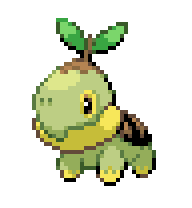
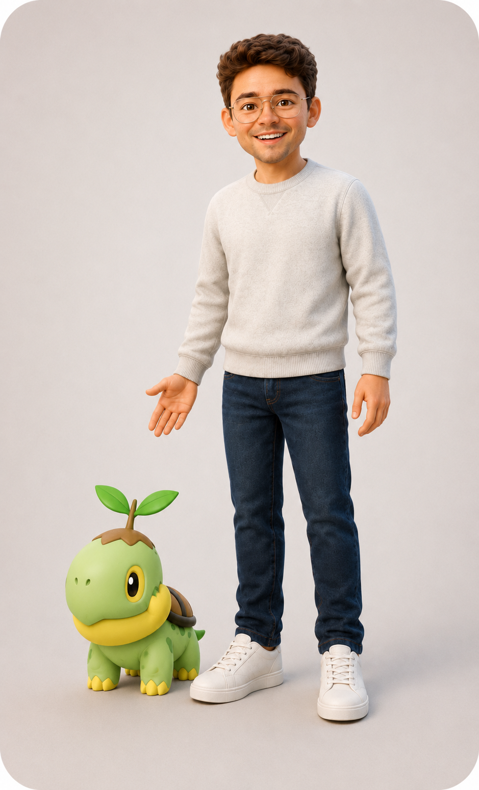
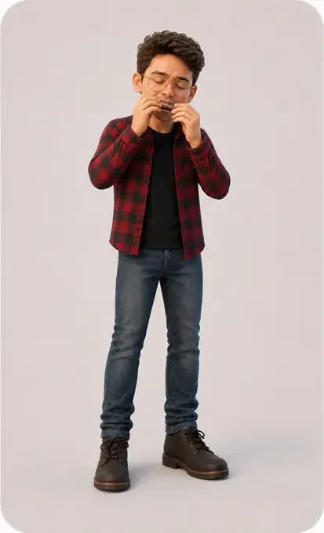
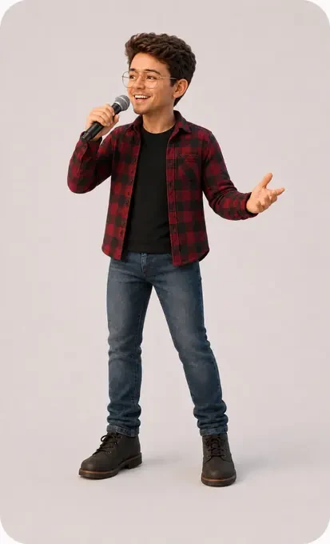

# Active avatar inventory raw map

No avatar files or site references were changed by this inventory.

## Referenced candidate assets
- `assets/doon-idle.gif` — `services.html:54` — </header><button aria-describedby="doonMessage" aria-label="Back to top" class="doon-guide" id="doonGuide" title="Back to top" type="button">Back to topTap Doon to return to the top.</button><main id="mainContent">
- `assets/doon-jump.gif` — `services.html:54` — </header><button aria-describedby="doonMessage" aria-label="Back to top" class="doon-guide" id="doonGuide" title="Back to top" type="button">Back to topTap Doon to return to the top.</button><main id="mainContent">
- `assets/doon-wave.gif` — `services.html:54` — </header><button aria-describedby="doonMessage" aria-label="Back to top" class="doon-guide" id="doonGuide" title="Back to top" type="button">Back to topTap Doon to return to the top.</button><main id="mainContent">
- `assets/Andrew-doon.PNG` — `services.html:68` — <section aria-labelledby="contactTitle" class="aw-site-contact" data-site-contact id="contact">

Get in touch
<h2 id="contactTitle">Tell me about your project.</h2>
Send the service, deadline, and budget you have in mind. A rough outline is enough.

<figure class="sf-portrait">

</figure>
<strong>Andrew Wolverton</strong>Brooklyn, New York<a class="sf-button" href="mailto:hello@awolverton.com">Email Andrew</a>

<form action="https://formsubmit.co/ajax/anwolver@gmail.com" class="sf-contact-form" data-site-contact-form id="contactForm" method="POST">
- `assets/andrew-doon.webp` — `services.html:68` — <section aria-labelledby="contactTitle" class="aw-site-contact" data-site-contact id="contact">

Get in touch
<h2 id="contactTitle">Tell me about your project.</h2>
Send the service, deadline, and budget you have in mind. A rough outline is enough.

<figure class="sf-portrait">

</figure>
<strong>Andrew Wolverton</strong>Brooklyn, New York<a class="sf-button" href="mailto:hello@awolverton.com">Email Andrew</a>

<form action="https://formsubmit.co/ajax/anwolver@gmail.com" class="sf-contact-form" data-site-contact-form id="contactForm" method="POST">
- `assets/Andrew-doon.PNG` — `projects.html:4` — <section aria-labelledby="contactTitle" class="aw-site-contact" data-site-contact id="contact">

Get in touch
<h2 id="contactTitle">Tell me about your project.</h2>
Send the service, deadline, and budget you have in mind. A rough outline is enough.

<figure class="sf-portrait">

</figure>
<strong>Andrew Wolverton</strong>Brooklyn, New York<a class="sf-button" href="mailto:hello@awolverton.com">Email Andrew</a>

<form action="https://formsubmit.co/ajax/anwolver@gmail.com" class="sf-contact-form" data-site-contact-form id="contactForm" method="POST">
- `assets/andrew-doon.webp` — `projects.html:4` — <section aria-labelledby="contactTitle" class="aw-site-contact" data-site-contact id="contact">

Get in touch
<h2 id="contactTitle">Tell me about your project.</h2>
Send the service, deadline, and budget you have in mind. A rough outline is enough.

<figure class="sf-portrait">

</figure>
<strong>Andrew Wolverton</strong>Brooklyn, New York<a class="sf-button" href="mailto:hello@awolverton.com">Email Andrew</a>

<form action="https://formsubmit.co/ajax/anwolver@gmail.com" class="sf-contact-form" data-site-contact-form id="contactForm" method="POST">
- `assets/doon-idle.gif` — `projects.html:20` — <footer class="aw-site-footer" data-site-footer>

<strong>Andrew Wolverton</strong>Brooklyn, New York
<nav class="sf-footer-nav" aria-label="Footer navigation"><a href="index.html">Home</a><a href="projects.html">Work</a><a href="services.html">Services</a><a href="index.html#about">About</a><a href="#contact">Contact</a><a href="music-lab/index.html">Lab</a></nav>
<a href="#top">Back to top</a>© 2026

</footer><button class="doon-guide workroom-doon" id="doonGuide" type="button" aria-expanded="false">Pick a project type to change the preview.</button>
- `assets/Headshot Option 2.jpg` — `ai-schools.html:97` — <section class="story-scene about-scene" id="aboutAndrew" data-scene-section="6" aria-labelledby="aboutTitle">
<figure><figcaption>Andrew Wolverton Brooklyn, New York</figcaption></figure>

Why Andrew
<h2 id="aboutTitle">Teaching experience meets practical systems work.</h2>
Andrew is a former Indiana classroom educator, curriculum and program builder, nonprofit founding partner, and human-led workflow designer. He knows the difference between a polished demo and something people can actually use in a busy room.

The lab teaches a repeatable build and review method. School policy, privacy, legal, cybersecurity, special-education, labor, and other regulated decisions remain with school leadership and qualified specialists.
<a class="quiet-button" href="index.html#about">Meet Andrew and see the work in context</a>

</section>
- `assets/Headshot Option 2.jpg` — `ai-schools.html:119` — <section class="context-panel" data-context-panel="6">
MEET ANDREW<b>07</b>
<h2>Teacher. Program builder. Systems designer.</h2>
Classroom experience shapes the facilitation. Practical systems work shapes the build.
<a href="index.html#about">See Andrew's full story</a></section>
- `assets/andrew-projects-work2.webp` — `MOBILE-ASSET-MANIFEST.md:10` — | Hero | `assets/andrew-projects-work2.webp` | Responsive portrait crop with floating discipline labels |
- `assets/andrew-avatar-lightbulb-loop.webm` — `MOBILE-ASSET-MANIFEST.md:11` — | Creative Rescue | `assets/andrew-avatar-lightbulb-loop.webm` | Muted looping motion behind the service card |
- `assets/andrew-projects-work2.webp` — `MOBILE-ASSET-MANIFEST.md:12` — | Build With Andrew | `assets/andrew-projects-work2.webp` | Full-card visual crop |
- `assets/andrew-avatar-performance-loop.webm` — `MOBILE-ASSET-MANIFEST.md:14` — | Music | `assets/andrew-avatar-performance-loop.webm` | Muted looping performance motion with static poster fallback |
- `assets/Headshot Option 2.jpg` — `MOBILE-ASSET-MANIFEST.md:15` — | About | `assets/Headshot Option 2.jpg` | Authentic headshot crop |
- `assets/doon-wave.gif` — `MOBILE-ASSET-MANIFEST.md:16` — | Closing | `assets/doon-wave.gif` | Existing companion animation |
- `assets/doon-idle.gif` — `index.html:67` — </header><button aria-describedby="doonMessage" aria-label="Back to top" class="doon-guide" id="doonGuide" title="Back to top" type="button">Back to topTap Doon to return to the top.</button><main id="mainContent"><section aria-labelledby="heroTitle" class="desk-hero" id="home">
- `assets/doon-jump.gif` — `index.html:67` — </header><button aria-describedby="doonMessage" aria-label="Back to top" class="doon-guide" id="doonGuide" title="Back to top" type="button">Back to topTap Doon to return to the top.</button><main id="mainContent"><section aria-labelledby="heroTitle" class="desk-hero" id="home">
- `assets/doon-wave.gif` — `index.html:67` — </header><button aria-describedby="doonMessage" aria-label="Back to top" class="doon-guide" id="doonGuide" title="Back to top" type="button">Back to topTap Doon to return to the top.</button><main id="mainContent"><section aria-labelledby="heroTitle" class="desk-hero" id="home">
- `assets/andrew-home-wave-transparent.png` — `index.html:77` — 
- `assets/andrew-ai-idea.webp` — `index.html:117` — </article><article class="home-project-card"><figure class="aw-avatar-matte"></figure>

AI and workflow systems
<h3>Human-led systems</h3>
Research, audits, outreach, and planning made faster without handing final judgment to the tool.
<a class="text-link" href="work/workflows/">See the workflow examples ↗︎</a>
</article>
- `assets/Headshot Option 2.png` — `index.html:124` — 
- `assets/Andrew-doon.PNG` — `index.html:216` — <section aria-labelledby="contactTitle" class="aw-site-contact" data-site-contact id="contact">

Get in touch
<h2 id="contactTitle">Tell me about your project.</h2>
Send the service, deadline, and budget you have in mind. A rough outline is enough.

<figure class="sf-portrait">

</figure>
<strong>Andrew Wolverton</strong>Brooklyn, New York<a class="sf-button" href="mailto:hello@awolverton.com">Email Andrew</a>

<form action="https://formsubmit.co/ajax/anwolver@gmail.com" class="sf-contact-form" data-site-contact-form id="contactForm" method="POST">
- `assets/andrew-doon.webp` — `index.html:216` — <section aria-labelledby="contactTitle" class="aw-site-contact" data-site-contact id="contact">

Get in touch
<h2 id="contactTitle">Tell me about your project.</h2>
Send the service, deadline, and budget you have in mind. A rough outline is enough.

<figure class="sf-portrait">

</figure>
<strong>Andrew Wolverton</strong>Brooklyn, New York<a class="sf-button" href="mailto:hello@awolverton.com">Email Andrew</a>

<form action="https://formsubmit.co/ajax/anwolver@gmail.com" class="sf-contact-form" data-site-contact-form id="contactForm" method="POST">
- `assets/andrew-avatar-wave.png` — `styles.css:16075` — background: url("assets/andrew-avatar-wave.png") center 24% / 82% auto no-repeat, linear-gradient(160deg, #90e5dc, #f7d87f);
- `assets/andrew-home-wave-transparent.png` — `mobile.html:33` — 
- `assets/andrew-avatar-performance-poster.png` — `mobile.html:154` — <video muted autoplay loop playsinline preload="metadata" poster="assets/andrew-avatar-performance-poster.png" aria-hidden="true">
- `assets/andrew-avatar-performance-loop.webm` — `mobile.html:155` — <source src="assets/andrew-avatar-performance-loop.webm" type="video/webm">
- `assets/Headshot Option 2.jpg` — `mobile.html:169` — 
- `assets/Andrew-doon.PNG` — `mobile.html:188` — <section aria-labelledby="contactTitle" class="aw-site-contact" data-site-contact id="contact">

Get in touch
<h2 id="contactTitle">Tell me about your project.</h2>
Send the service, deadline, and budget you have in mind. A rough outline is enough.

<figure class="sf-portrait">

</figure>
<strong>Andrew Wolverton</strong>Brooklyn, New York<a class="sf-button" href="mailto:hello@awolverton.com">Email Andrew</a>

<form action="https://formsubmit.co/ajax/anwolver@gmail.com" class="sf-contact-form" data-site-contact-form id="contactForm" method="POST">
- `assets/andrew-doon.webp` — `mobile.html:188` — <section aria-labelledby="contactTitle" class="aw-site-contact" data-site-contact id="contact">

Get in touch
<h2 id="contactTitle">Tell me about your project.</h2>
Send the service, deadline, and budget you have in mind. A rough outline is enough.

<figure class="sf-portrait">

</figure>
<strong>Andrew Wolverton</strong>Brooklyn, New York<a class="sf-button" href="mailto:hello@awolverton.com">Email Andrew</a>

<form action="https://formsubmit.co/ajax/anwolver@gmail.com" class="sf-contact-form" data-site-contact-form id="contactForm" method="POST">
- `../assets/doon-idle.gif` — `projects/discovery-sound-garden.html:52` — <button aria-describedby="doonMessage" aria-label="Back to top" class="doon-guide" id="doonGuide" title="Back to top" type="button">Back to topTap Doon to return to the top.</button>
- `../assets/doon-jump.gif` — `projects/discovery-sound-garden.html:52` — <button aria-describedby="doonMessage" aria-label="Back to top" class="doon-guide" id="doonGuide" title="Back to top" type="button">Back to topTap Doon to return to the top.</button>
- `../assets/doon-wave.gif` — `projects/discovery-sound-garden.html:52` — <button aria-describedby="doonMessage" aria-label="Back to top" class="doon-guide" id="doonGuide" title="Back to top" type="button">Back to topTap Doon to return to the top.</button>
- `../assets/andrew-doon.webp` — `projects/discovery-sound-garden.html:87` — <figure class="case-study-portrait-figure"><figcaption>A founding-partner-led organization with warmth, personality, and a clear invitation.</figcaption></figure>
- `../assets/Andrew-doon.PNG` — `projects/discovery-sound-garden.html:96` — <section aria-labelledby="contactTitle" class="aw-site-contact" data-site-contact id="contact">

Get in touch
<h2 id="contactTitle">Tell me about your project.</h2>
Send the service, deadline, and budget you have in mind. A rough outline is enough.

<figure class="sf-portrait">

</figure>
<strong>Andrew Wolverton</strong>Brooklyn, New York<a class="sf-button" href="mailto:hello@awolverton.com">Email Andrew</a>

<form action="https://formsubmit.co/ajax/anwolver@gmail.com" class="sf-contact-form" data-site-contact-form id="contactForm" method="POST">
- `../assets/andrew-doon.webp` — `projects/discovery-sound-garden.html:96` — <section aria-labelledby="contactTitle" class="aw-site-contact" data-site-contact id="contact">

Get in touch
<h2 id="contactTitle">Tell me about your project.</h2>
Send the service, deadline, and budget you have in mind. A rough outline is enough.

<figure class="sf-portrait">

</figure>
<strong>Andrew Wolverton</strong>Brooklyn, New York<a class="sf-button" href="mailto:hello@awolverton.com">Email Andrew</a>

<form action="https://formsubmit.co/ajax/anwolver@gmail.com" class="sf-contact-form" data-site-contact-form id="contactForm" method="POST">
- `../assets/doon-idle.gif` — `projects/edit-suite.html:52` — <button aria-describedby="doonMessage" aria-label="Back to top" class="doon-guide" id="doonGuide" title="Back to top" type="button">Back to topTap Doon to return to the top.</button>
- `../assets/doon-jump.gif` — `projects/edit-suite.html:52` — <button aria-describedby="doonMessage" aria-label="Back to top" class="doon-guide" id="doonGuide" title="Back to top" type="button">Back to topTap Doon to return to the top.</button>
- `../assets/doon-wave.gif` — `projects/edit-suite.html:52` — <button aria-describedby="doonMessage" aria-label="Back to top" class="doon-guide" id="doonGuide" title="Back to top" type="button">Back to topTap Doon to return to the top.</button>
- `../assets/andrew-performance-harp.webp` — `projects/edit-suite.html:80` — <figure><figcaption>Live performance keeps the editing work grounded in breath, rhythm, and audience connection.</figcaption></figure>
- `../assets/Andrew-doon.PNG` — `projects/edit-suite.html:89` — <section aria-labelledby="contactTitle" class="aw-site-contact" data-site-contact id="contact">

Get in touch
<h2 id="contactTitle">Tell me about your project.</h2>
Send the service, deadline, and budget you have in mind. A rough outline is enough.

<figure class="sf-portrait">

</figure>
<strong>Andrew Wolverton</strong>Brooklyn, New York<a class="sf-button" href="mailto:hello@awolverton.com">Email Andrew</a>

<form action="https://formsubmit.co/ajax/anwolver@gmail.com" class="sf-contact-form" data-site-contact-form id="contactForm" method="POST">
- `../assets/andrew-doon.webp` — `projects/edit-suite.html:89` — <section aria-labelledby="contactTitle" class="aw-site-contact" data-site-contact id="contact">

Get in touch
<h2 id="contactTitle">Tell me about your project.</h2>
Send the service, deadline, and budget you have in mind. A rough outline is enough.

<figure class="sf-portrait">

</figure>
<strong>Andrew Wolverton</strong>Brooklyn, New York<a class="sf-button" href="mailto:hello@awolverton.com">Email Andrew</a>

<form action="https://formsubmit.co/ajax/anwolver@gmail.com" class="sf-contact-form" data-site-contact-form id="contactForm" method="POST">
- `../assets/doon-idle.gif` — `projects/yolele-ingredients.html:52` — <button aria-describedby="doonMessage" aria-label="Back to top" class="doon-guide" id="doonGuide" title="Back to top" type="button">Back to topTap Doon to return to the top.</button>
- `../assets/doon-jump.gif` — `projects/yolele-ingredients.html:52` — <button aria-describedby="doonMessage" aria-label="Back to top" class="doon-guide" id="doonGuide" title="Back to top" type="button">Back to topTap Doon to return to the top.</button>
- `../assets/doon-wave.gif` — `projects/yolele-ingredients.html:52` — <button aria-describedby="doonMessage" aria-label="Back to top" class="doon-guide" id="doonGuide" title="Back to top" type="button">Back to topTap Doon to return to the top.</button>
- `../assets/Andrew-doon.PNG` — `projects/yolele-ingredients.html:89` — <section aria-labelledby="contactTitle" class="aw-site-contact" data-site-contact id="contact">

Get in touch
<h2 id="contactTitle">Tell me about your project.</h2>
Send the service, deadline, and budget you have in mind. A rough outline is enough.

<figure class="sf-portrait">

</figure>
<strong>Andrew Wolverton</strong>Brooklyn, New York<a class="sf-button" href="mailto:hello@awolverton.com">Email Andrew</a>

<form action="https://formsubmit.co/ajax/anwolver@gmail.com" class="sf-contact-form" data-site-contact-form id="contactForm" method="POST">
- `../assets/andrew-doon.webp` — `projects/yolele-ingredients.html:89` — <section aria-labelledby="contactTitle" class="aw-site-contact" data-site-contact id="contact">

Get in touch
<h2 id="contactTitle">Tell me about your project.</h2>
Send the service, deadline, and budget you have in mind. A rough outline is enough.

<figure class="sf-portrait">

</figure>
<strong>Andrew Wolverton</strong>Brooklyn, New York<a class="sf-button" href="mailto:hello@awolverton.com">Email Andrew</a>

<form action="https://formsubmit.co/ajax/anwolver@gmail.com" class="sf-contact-form" data-site-contact-form id="contactForm" method="POST">
- `../assets/doon-idle.gif` — `projects/porch-stomp.html:52` — <button aria-describedby="doonMessage" aria-label="Back to top" class="doon-guide" id="doonGuide" title="Back to top" type="button">Back to topTap Doon to return to the top.</button>
- `../assets/doon-jump.gif` — `projects/porch-stomp.html:52` — <button aria-describedby="doonMessage" aria-label="Back to top" class="doon-guide" id="doonGuide" title="Back to top" type="button">Back to topTap Doon to return to the top.</button>
- `../assets/doon-wave.gif` — `projects/porch-stomp.html:52` — <button aria-describedby="doonMessage" aria-label="Back to top" class="doon-guide" id="doonGuide" title="Back to top" type="button">Back to topTap Doon to return to the top.</button>
- `../assets/Andrew-doon.PNG` — `projects/porch-stomp.html:91` — <section aria-labelledby="contactTitle" class="aw-site-contact" data-site-contact id="contact">

Get in touch
<h2 id="contactTitle">Tell me about your project.</h2>
Send the service, deadline, and budget you have in mind. A rough outline is enough.

<figure class="sf-portrait">

</figure>
<strong>Andrew Wolverton</strong>Brooklyn, New York<a class="sf-button" href="mailto:hello@awolverton.com">Email Andrew</a>

<form action="https://formsubmit.co/ajax/anwolver@gmail.com" class="sf-contact-form" data-site-contact-form id="contactForm" method="POST">
- `../assets/andrew-doon.webp` — `projects/porch-stomp.html:91` — <section aria-labelledby="contactTitle" class="aw-site-contact" data-site-contact id="contact">

Get in touch
<h2 id="contactTitle">Tell me about your project.</h2>
Send the service, deadline, and budget you have in mind. A rough outline is enough.

<figure class="sf-portrait">

</figure>
<strong>Andrew Wolverton</strong>Brooklyn, New York<a class="sf-button" href="mailto:hello@awolverton.com">Email Andrew</a>

<form action="https://formsubmit.co/ajax/anwolver@gmail.com" class="sf-contact-form" data-site-contact-form id="contactForm" method="POST">
- `../assets/doon-idle.gif` — `projects/rooftop-ramblers.html:52` — <button aria-describedby="doonMessage" aria-label="Back to top" class="doon-guide" id="doonGuide" title="Back to top" type="button">Back to topTap Doon to return to the top.</button>
- `../assets/doon-jump.gif` — `projects/rooftop-ramblers.html:52` — <button aria-describedby="doonMessage" aria-label="Back to top" class="doon-guide" id="doonGuide" title="Back to top" type="button">Back to topTap Doon to return to the top.</button>
- `../assets/doon-wave.gif` — `projects/rooftop-ramblers.html:52` — <button aria-describedby="doonMessage" aria-label="Back to top" class="doon-guide" id="doonGuide" title="Back to top" type="button">Back to topTap Doon to return to the top.</button>
- `../assets/andrew-performance-singing.webp` — `projects/rooftop-ramblers.html:63` — <figure></figure>
- `../assets/andrew-performance-singing.webp` — `projects/rooftop-ramblers.html:78` — <figure><figcaption>Live performance is the product the system is built to support.</figcaption></figure>
- `../assets/andrew-performance-harp.webp` — `projects/rooftop-ramblers.html:79` — <figure><figcaption>Booking operations stay connected to musicianship, personality, and audience fit.</figcaption></figure>
- `../assets/Andrew-doon.PNG` — `projects/rooftop-ramblers.html:88` — <section aria-labelledby="contactTitle" class="aw-site-contact" data-site-contact id="contact">

Get in touch
<h2 id="contactTitle">Tell me about your project.</h2>
Send the service, deadline, and budget you have in mind. A rough outline is enough.

<figure class="sf-portrait">

</figure>
<strong>Andrew Wolverton</strong>Brooklyn, New York<a class="sf-button" href="mailto:hello@awolverton.com">Email Andrew</a>

<form action="https://formsubmit.co/ajax/anwolver@gmail.com" class="sf-contact-form" data-site-contact-form id="contactForm" method="POST">
- `../assets/andrew-doon.webp` — `projects/rooftop-ramblers.html:88` — <section aria-labelledby="contactTitle" class="aw-site-contact" data-site-contact id="contact">

Get in touch
<h2 id="contactTitle">Tell me about your project.</h2>
Send the service, deadline, and budget you have in mind. A rough outline is enough.

<figure class="sf-portrait">

</figure>
<strong>Andrew Wolverton</strong>Brooklyn, New York<a class="sf-button" href="mailto:hello@awolverton.com">Email Andrew</a>

<form action="https://formsubmit.co/ajax/anwolver@gmail.com" class="sf-contact-form" data-site-contact-form id="contactForm" method="POST">
- `assets/andrew-ai-idea.png` — `work/workroom.js:8` — workflows:{n:"05 / 05",s:"WORKFLOWS · PROJECT PREVIEW",t:"WORKFLOWS",h:"Booking research and everyday systems.",d:"Booking lists, grant research, website audits, meal plans, and computer setup.",i:"assets/andrew-ai-idea.png",a:"Andrew with a light bulb",u:"work/workflows/"}
- `../../assets/Andrew-doon.PNG` — `work/workflows/index.html:4` — <section aria-labelledby="contactTitle" class="aw-site-contact" data-site-contact id="contact">

Get in touch
<h2 id="contactTitle">Tell me about your project.</h2>
Send the service, deadline, and budget you have in mind. A rough outline is enough.

<figure class="sf-portrait">

</figure>
<strong>Andrew Wolverton</strong>Brooklyn, New York<a class="sf-button" href="mailto:hello@awolverton.com">Email Andrew</a>

<form action="https://formsubmit.co/ajax/anwolver@gmail.com" class="sf-contact-form" data-site-contact-form id="contactForm" method="POST">
- `../../assets/andrew-doon.webp` — `work/workflows/index.html:4` — <section aria-labelledby="contactTitle" class="aw-site-contact" data-site-contact id="contact">

Get in touch
<h2 id="contactTitle">Tell me about your project.</h2>
Send the service, deadline, and budget you have in mind. A rough outline is enough.

<figure class="sf-portrait">

</figure>
<strong>Andrew Wolverton</strong>Brooklyn, New York<a class="sf-button" href="mailto:hello@awolverton.com">Email Andrew</a>

<form action="https://formsubmit.co/ajax/anwolver@gmail.com" class="sf-contact-form" data-site-contact-form id="contactForm" method="POST">
- `../../assets/doon-idle.gif` — `work/workflows/index.html:20` — <footer class="aw-site-footer" data-site-footer>

<strong>Andrew Wolverton</strong>Brooklyn, New York
<nav class="sf-footer-nav" aria-label="Footer navigation"><a href="../../index.html">Home</a><a href="../../projects.html">Work</a><a href="../../services.html">Services</a><a href="../../index.html#about">About</a><a href="#contact">Contact</a><a href="../../music-lab/index.html">Lab</a></nav>
<a href="#top">Back to top</a>© 2026

</footer><button class="doon-guide workroom-doon" id="doonGuide" type="button" aria-expanded="false">Start with the task you already repeat.</button><script src="../../site-footer.js?v=20260916-si

## Candidate avatar/portrait assets in assets/
- `assets/doon-wave.gif` (12714 bytes)
- `assets/Andrew-performance-harp.PNG` (2491718 bytes)
- `assets/andrew-projects-work2.webp` (68542 bytes)
- `assets/andrew-avatar-performance.png` (1777093 bytes)
- `assets/andrew-avatar-lightbulb-loop.mp4` (117686 bytes)
- `assets/andrew-doon.webp` (80010 bytes)
- `assets/Headshot Option 2.jpg` (185898 bytes)
- `assets/andrew-headshot-alt.jpg` (237392 bytes)
- `assets/andrew-home-wave.png` (832676 bytes)
- `assets/andrew-projects-work2.PNG` (1847158 bytes)
- `assets/avatar-animation-contact-sheet.jpg` (799297 bytes)
- `assets/andrew-ai-idea.webp` (32508 bytes)
- `assets/andrew-projects-work.webp` (53020 bytes)
- `assets/andrew-home-wave.webp` (36856 bytes)
- `assets/doon-jump.gif` (15623 bytes)
- `assets/Andrew-performance singing.png` (1877655 bytes)
- `assets/andrew-performance-harp.webp` (75714 bytes)
- `assets/andrew-avatar-wave.png` (1757978 bytes)
- `assets/andrew-avatar-performance-loop.webm` (70190 bytes)
- `assets/andrew-home-still-transparent.png` (755036 bytes)
- `assets/Andrew-doon.PNG` (2669675 bytes)
- `assets/doon-idle.gif` (19145 bytes)
- `assets/andrew-avatar-lightbulb.png` (1638302 bytes)
- `assets/andrew-avatar-performance-loop.mp4` (89287 bytes)
- `assets/Headshot Option 2.png` (9490300 bytes)
- `assets/andrew-projects-work.PNG` (2329466 bytes)
- `assets/andrew-home-wave-transparent.png` (631520 bytes)
- `assets/andrew-ai-idea.png` (782819 bytes)
- `assets/andrew-avatar-lightbulb-loop.webm` (49814 bytes)
- `assets/andrew-performance-singing.webp` (82394 bytes)
- `assets/andrew-avatar-performance-poster.png` (842137 bytes)
- `assets/characters/doon-jump.gif` (8484 bytes)
- `assets/characters/doon-idle.gif` (7154 bytes)
- `assets/characters/doon-bounce.gif` (7173 bytes)
- `assets/about me gallery/Ken Davenport and Andrew.jpg` (2506707 bytes)

## Avatar-related source lines
- `script.js:1774` — function setupHeroGreeter() {
- `script.js:1775` — const greeter = qs("#heroGreeter");
- `script.js:1776` — if (!greeter) return;
- `script.js:1778` — const trigger = qs("#heroGreeterAvatar", greeter);
- `script.js:1779` — const image = qs("#heroGreeterImage", greeter);
- `script.js:1782` — const sessionKey = "aw-home-greeter-seen";
- `script.js:1796` — greeter.classList.add("is-visible");
- `script.js:1798` — hideTimer = window.setTimeout(() => greeter.classList.remove("is-visible"), duration);
- `script.js:1804` — greeter.classList.remove("is-visible");
- `script.js:2233` — setupHeroGreeter();
- `services.html:68` — <section aria-labelledby="contactTitle" class="aw-site-contact" data-site-contact id="contact">

Get in touch
<h2 id="contactTitle">Tell me about your project.</h2>
Send the service, deadline, and budget you have in mind. A rough outline is enough.

<figure class="sf-portrait">

</figure>
<strong>Andrew Wolverton</strong>Brooklyn, New York<a class="sf-button" href="mailto:hello@awolverton.com">Email Andrew</a>

<form action="https://formsubmit.co/ajax/anwolver@gmail.com" class="sf-contact-form" data-site-contact-form id="contactForm" method="POST">
- `mobile-landing.js:6` — var heroGreeter = document.querySelector("#mobileHeroGreeter");
- `mobile-landing.js:7` — var heroGreeterAvatar = document.querySelector("#mobileHeroGreeterAvatar");
- `mobile-landing.js:24` — if (heroGreeter && heroGreeterAvatar) {
- `mobile-landing.js:28` — heroGreeter.classList.add("is-visible");
- `mobile-landing.js:33` — if (!heroGreeter.matches(":focus-within")) heroGreeter.classList.remove("is-visible");
- `mobile-landing.js:36` — heroGreeterAvatar.addEventListener("click", function () {
- `mobile-landing.js:40` — heroGreeterAvatar.addEventListener("mouseenter", showGreeting);
- `mobile-landing.js:41` — heroGreeterAvatar.addEventListener("mouseleave", function () { hideGreeting(900); });
- `mobile-landing.js:42` — heroGreeterAvatar.addEventListener("focus", showGreeting);
- `mobile-landing.js:43` — heroGreeterAvatar.addEventListener("blur", function () { hideGreeting(900); });
- `mobile-landing.js:45` — if (!sessionStorage.getItem("aw-mobile-greeter-seen")) {
- `mobile-landing.js:46` — sessionStorage.setItem("aw-mobile-greeter-seen", "1");
- `projects.html:4` — <section aria-labelledby="contactTitle" class="aw-site-contact" data-site-contact id="contact">

Get in touch
<h2 id="contactTitle">Tell me about your project.</h2>
Send the service, deadline, and budget you have in mind. A rough outline is enough.

<figure class="sf-portrait">

</figure>
<strong>Andrew Wolverton</strong>Brooklyn, New York<a class="sf-button" href="mailto:hello@awolverton.com">Email Andrew</a>

<form action="https://formsubmit.co/ajax/anwolver@gmail.com" class="sf-contact-form" data-site-contact-form id="contactForm" method="POST">
- `ai-schools.html:97` — <section class="story-scene about-scene" id="aboutAndrew" data-scene-section="6" aria-labelledby="aboutTitle">
<figure><figcaption>Andrew Wolverton Brooklyn, New York</figcaption></figure>

Why Andrew
<h2 id="aboutTitle">Teaching experience meets practical systems work.</h2>
Andrew is a former Indiana classroom educator, curriculum and program builder, nonprofit founding partner, and human-led workflow designer. He knows the difference between a polished demo and something people can actually use in a busy room.

The lab teaches a repeatable build and review method. School policy, privacy, legal, cybersecurity, special-education, labor, and other regulated decisions remain with school leadership and qualified specialists.
<a class="quiet-button" href="index.html#about">Meet Andrew and see the work in context</a>

</section>
- `ai-schools.html:119` — <section class="context-panel" data-context-panel="6">
MEET ANDREW<b>07</b>
<h2>Teacher. Program builder. Systems designer.</h2>
Classroom experience shapes the facilitation. Practical systems work shapes the build.
<a href="index.html#about">See Andrew's full story</a></section>
- `mobile-landing.css:144` — .mobile-hero-greeter {
- `mobile-landing.css:153` — .mobile-hero-greeter-avatar {
- `mobile-landing.css:165` — .mobile-hero-greeter-avatar img {
- `mobile-landing.css:172` — .mobile-hero-greeter-avatar:focus-visible {
- `mobile-landing.css:177` — .mobile-hero-greeter-bubble {
- `mobile-landing.css:196` — .mobile-hero-greeter-bubble::after {
- `mobile-landing.css:208` — .mobile-hero-greeter.is-visible .mobile-hero-greeter-bubble,
- `mobile-landing.css:209` — .mobile-hero-greeter:focus-within .mobile-hero-greeter-bubble {
- `mobile-landing.css:213` — .mobile-hero-greeter-bubble small {
- `mobile-landing.css:222` — .mobile-hero-greeter-bubble strong { font-size: 1.08rem; line-height: 1; }
- `mobile-landing.css:867` — .mobile-hero-greeter { right: 8px; width: 88px; height: 96px; }
- `mobile-landing.css:868` — .mobile-hero-greeter-avatar { height: 88px; }
- `mobile-landing.css:869` — .mobile-hero-greeter-bubble { right: 54px; width: 132px; padding: 9px 10px; }
- `mobile-landing.css:870` — .mobile-hero-greeter-bubble strong { font-size: 1rem; }
- `MOBILE-ASSET-MANIFEST.md:11` — | Creative Rescue | `assets/andrew-avatar-lightbulb-loop.webm` | Muted looping motion behind the service card |
- `MOBILE-ASSET-MANIFEST.md:14` — | Music | `assets/andrew-avatar-performance-loop.webm` | Muted looping performance motion with static poster fallback |
- `MOBILE-ASSET-MANIFEST.md:15` — | About | `assets/Headshot Option 2.jpg` | Authentic headshot crop |
- `index.html:75` — 

- `index.html:76` — <button aria-describedby="heroGreeterBubble" aria-label="Replay Andrew's welcome" class="hero-greeter-avatar" id="heroGreeterAvatar" type="button">
- `index.html:77` — 
- `index.html:79` — 

- `index.html:117` — </article><article class="home-project-card"><figure class="aw-avatar-matte"></figure>

AI and workflow systems
<h3>Human-led systems</h3>
Research, audits, outreach, and planning made faster without handing final judgment to the tool.
<a class="text-link" href="work/workflows/">See the workflow examples ↗︎</a>
</article>
- `index.html:124` — 
- `index.html:216` — <section aria-labelledby="contactTitle" class="aw-site-contact" data-site-contact id="contact">

Get in touch
<h2 id="contactTitle">Tell me about your project.</h2>
Send the service, deadline, and budget you have in mind. A rough outline is enough.

<figure class="sf-portrait">

</figure>
<strong>Andrew Wolverton</strong>Brooklyn, New York<a class="sf-button" href="mailto:hello@awolverton.com">Email Andrew</a>

<form action="https://formsubmit.co/ajax/anwolver@gmail.com" class="sf-contact-form" data-site-contact-form id="contactForm" method="POST">
- `site-footer.css:48` — /* Match the avatar's near-white outer background, without a contrasting mat or shadow. */
- `site-footer.css:49` — .workroom-page .projection-image-wrap.is-avatar-preview{background:#fefefe!important;box-shadow:none}
- `site-footer.css:50` — .workroom-page .projection-image-wrap.is-avatar-preview img{background:#fefefe!important;object-fit:contain!important;object-position:center;box-shadow:none;border:0}
- `site-footer.css:51` — .aw-avatar-matte,.aw-avatar-matte img{background:#fefefe!important;box-shadow:none!important}
- `site-footer.css:52` — .aw-avatar-matte{overflow:hidden;border-radius:20px;isolation:isolate}
- `site-footer.css:53` — .aw-avatar-matte img{object-fit:contain!important;display:block}
- `styles.css:436` — .site-header__inner, .ui-tabs, .ui-accordion__item, .ui-subnav, .site-footer, .hero-copy-wall-card, .scene-projection, .avatar-card figcaption {
- `styles.css:761` — .avatar-card {
- `styles.css:771` — .avatar-card img {
- `styles.css:777` — .avatar-card figcaption {
- `styles.css:792` — .avatar-card figcaption strong {
- `styles.css:796` — .avatar-card figcaption span {
- `styles.css:801` — .avatar-card-wave {
- `styles.css:1759` — .performance-avatar-card {
- `styles.css:1767` — .performance-avatar-card img {
- `styles.css:1775` — .performance-avatar-card div {
- `styles.css:1780` — .performance-avatar-card small {
- `styles.css:1787` — .performance-avatar-card strong {
- `styles.css:1793` — .performance-avatar-card a {
- `styles.css:1840` — .ai-avatar-card {
- `styles.css:2346` — .about-avatar {
- `styles.css:2753` — .avatar-card-wave {
- `styles.css:2809` — .ai-avatar-card {
- `styles.css:2873` — .about-avatar {
- `styles.css:2912` — .avatar-card-wave,
- `styles.css:2913` — .ai-avatar-card,
- `styles.css:2914` — .about-avatar {
- `styles.css:2995` — .performance-avatar-card {
- `styles.css:2999` — .performance-avatar-card img {
- `styles.css:3054` — STATIC AVATARS AND FINAL LAUNCH COMPONENTS
- `styles.css:3057` — .static-avatar-card {
- `styles.css:3061` — .static-avatar-image {
- `styles.css:3069` — .home-avatar-image {
- `styles.css:3073` — .ai-avatar-image {
- `styles.css:3077` — .about-avatar-image {
- `styles.css:4454` — /* Contact headshot */
- `styles.css:4456` — .contact-headshot-card {
- `styles.css:4465` — .contact-headshot-card img { width: 100%; height: 100%; object-fit: cover; object-position: center top; }
- `styles.css:4466` — .contact-headshot-card img.headshot-fallback { object-fit: contain; background: #eee8de; }
- `styles.css:4604` — .contact-headshot-card { width: min(180px, 46vw); }
- `styles.css:4671` — #performanceStudio{position:relative;overflow:hidden;border-radius:24px;background:radial-gradient(circle at 20% 0%,rgba(255,82,164,.28),transparent 36%),radial-gradient(circle at 82% 0%,rgba(255,190,65,.24),transparent 36%),linear-gradient(145deg,#1d1026,#091b19 72%);padding:clamp(20px,3vw,36px);color:#fff}#performanceStudio .studio-copy p,#performanceStudio .performance-avatar-card span{color:rgba(255,255,255,.76)}.performance-console{border-color:rgba(255,255,255,.14);background:rgba(0,0,0,.24)}.about-avatar-duo .about-avatar-image{width:100%;aspect-ratio:4/5;object-fit:cover;object-position:center 20%}.contact-headshot-card img{width:100%;aspect-ratio:4/5;object-fit:contain;background:rgba(255,255,255,.3)}.case-copy p,.campaign-planner p,.ai-demonstration p,.service-offering p,.about-copy p,.contact-copy p,.faq-grid p{font-size:max(1rem,16px)}.ai-input-row span, .ai-pipeline small, .tool-logo-grid article>span:last-child, .pricing-note, .form-note{font-size:max(.82rem,13px)}
- `styles.css:4785` — .contact-headshot-card { grid-row:1/7; width:100%; max-width:380px; height:auto; aspect-ratio:4/5; margin:0; align-self:start; }
- `styles.css:4800` — .contact-copy{grid-template-columns:1fr}.contact-headshot-card, .contact-copy>h2, .contact-copy>p, .contact-copy>.contact-options{grid-column:1}.contact-headshot-card{grid-row:auto;max-width:320px;margin:0 auto 28px}
- `styles.css:4997` — .contact-headshot-card {
- `styles.css:5008` — .contact-headshot-card img,
- `styles.css:5009` — .contact-headshot-card img.headshot-fallback {
- `styles.css:5053` — .contact-headshot-card { max-width: 620px !important; }
- `styles.css:5087` — .contact-headshot-card { aspect-ratio: 16 / 10 !important; }
- `styles.css:5098` — .contact-headshot-card { aspect-ratio: 1 / 1 !important; padding: 12px !important; }
- `styles.css:5707` — .avatar-card {
- `styles.css:5713` — .avatar-card img,
- `styles.css:5714` — .static-avatar-image {
- `styles.css:5975` — .performance-avatar-card {
- `styles.css:6172` — .contact-headshot-card {
- `styles.css:6180` — .contact-headshot-card img,
- `styles.css:6181` — .contact-headshot-card img.headshot-fallback {
- `styles.css:6343` — .about-avatar {
- `styles.css:6348` — .about-avatar .about-avatar-image {
- `styles.css:6360` — /* Let the desktop booking avatar become part of the mobile booking story. */
- `styles.css:6499` — Final mobile microfix: complete avatar framing and keep the
- `styles.css:7191` — .home-about-layout .about-avatar { min-height: 470px; }
- `styles.css:7440` — .home-about-layout .about-avatar { min-height: 0 !important; }
- `styles.css:7733` — /* Homepage headshot */
- `styles.css:7744` — .home-about-layout .about-avatar {
- `styles.css:7753` — .home-about-layout .about-avatar-image {
- `styles.css:7784` — .contact-headshot-card {
- `styles.css:7798` — .contact-headshot-card img,
- `styles.css:7799` — .contact-headshot-card img.headshot-fallback {
- `styles.css:7952` — .about-avatar-duo {
- `styles.css:7957` — .about-avatar-duo .about-avatar-image {
- `styles.css:8140` — .home-about-layout .about-avatar {
- `styles.css:8158` — .contact-headshot-card, .contact-copy > h2, .contact-copy > p, .contact-copy > .contact-options{
- `styles.css:8162` — .contact-headshot-card {
- `styles.css:8606` — /* Homepage headshot: full landscape image, caption below, no face crop or label overlay. */
- `styles.css:8608` — .page-home .home-about-layout .about-avatar {
- `styles.css:8617` — .page-home .home-about-layout .about-avatar-image {
- `styles.css:8627` — .page-home .home-about-layout .about-avatar figcaption {
- `styles.css:8638` — .page-home .home-about-layout .about-avatar figcaption strong { font-size: 1.05rem; line-height: 1.15; }
- `styles.css:8639` — .page-home .home-about-layout .about-avatar figcaption span { max-width: 44ch; color: rgba(23,63,53,.72); font-size: .92rem; line-height: 1.4; }
- `styles.css:8645` — .contact-headshot-card { max-width: 230px !important; padding: 9px !important; border-radius: 22px !important; }
- `styles.css:8646` — .contact-headshot-card img { border-radius: 15px !important; }
- `styles.css:8859` — .home-about-preview .about-avatar { overflow: visible; }
- `styles.css:8860` — .home-about-preview .about-avatar-image { border-radius: 24px 24px 0 0; }
- `styles.css:9150` — .page-projects .performance-avatar-card { display:grid; grid-template-columns:74px 1fr; gap:14px; align-items:center; padding:12px; border:1px solid rgba(255,255,255,.14); border-radius:15px; background:rgba(255,255,255,.06); }
- `styles.css:9151` — .page-projects .performance-avatar-card img { width:74px; height:92px; object-fit:contain; border-radius:10px; background:rgba(255,255,255,.88); }
- `styles.css:9152` — .page-projects .performance-avatar-card div { display:grid; gap:4px; }
- `styles.css:9153` — .page-projects .performance-avatar-card small { color:var(--pink); font-weight:800; text-transform:uppercase; letter-spacing:.1em; }
- `styles.css:9154` — .page-projects .performance-avatar-card a { color:var(--aqua); font-weight:800; }
- `styles.css:9219` — .page-projects .performance-avatar-card { grid-template-columns:60px 1fr; }
- `styles.css:9220` — .page-projects .performance-avatar-card img { width:60px; height:76px; }
- `styles.css:9504` — .page-home .about-avatar { margin:0; overflow:hidden !important; border:1px solid var(--line) !important; border-radius:24px !important; background:var(--white); box-shadow:var(--shadow-soft); }
- `styles.css:9505` — .page-home .about-avatar-image { display:block; width:100%; height:auto !important; aspect-ratio:3/2; object-fit:cover !important; object-position:center; border-radius:0 !important; }
- `styles.css:9514` — .contact-headshot-card { width:min(250px,100%); margin:0 0 26px; overflow:hidden; border:1px solid rgba(255,255,255,.22); border-radius:22px; background:rgba(255,255,255,.12); }
- `styles.css:9515` — .contact-headshot-card img { width:100%; height:auto; object-fit:contain; }
- `styles.css:11299` — .page-projects .performance-avatar-card {
- `styles.css:11310` — .page-projects .performance-avatar-card img {
- `styles.css:11318` — .page-projects .performance-avatar-card div {
- `styles.css:11323` — .page-projects .performance-avatar-card small {
- `styles.css:11330` — .page-projects .performance-avatar-card a,
- `styles.css:11462` — .page-projects .performance-avatar-card {
- `styles.css:11466` — .page-projects .performance-avatar-card img {
- `styles.css:13062` — HOMEPAGE HERO GREETER
- `styles.css:13075` — .page-home .hero-greeter {
- `styles.css:13081` — .page-home .hero-greeter-avatar {
- `styles.css:13091` — .page-home .hero-greeter-avatar img {
- `styles.css:13099` — .page-home .hero-greeter-bubble {
- `styles.css:13112` — .page-home .hero-greeter-bubble::after {
- `styles.css:13118` — .page-home .hero-greeter.is-visible .hero-greeter-bubble,
- `styles.css:13119` — .page-home .hero-greeter:focus-within .hero-greeter-bubble {
- `styles.css:13124` — .page-home .hero-greeter-bubble small {
- `styles.css:13132` — .page-home .hero-greeter-bubble strong {
- `styles.css:13140` — .page-home .hero-greeter {
- `styles.css:13147` — .page-home .hero-greeter-avatar {
- `styles.css:13153` — .page-home .hero-greeter-bubble {
- `styles.css:13163` — .page-home .hero-greeter-bubble::after {
- `styles.css:13173` — .page-home .hero-greeter-bubble small {
- `styles.css:13178` — .page-home .hero-greeter-bubble strong {
- `styles.css:13197` — .page-home .hero-greeter {
- `styles.css:13205` — .page-home .hero-greeter-avatar {
- `styles.css:13211` — .page-home .hero-greeter-bubble {
- `styles.css:13223` — .page-home .hero-greeter-bubble::after {
- `styles.css:13233` — .page-home .hero-greeter-bubble small {
- `styles.css:13238` — .page-home .hero-greeter-bubble strong {
- `styles.css:13257` — .page-home .hero-greeter {
- `styles.css:13265` — .page-home .hero-greeter-avatar {
- `styles.css:13272` — .page-home .hero-greeter-bubble {
- `styles.css:13283` — .page-home .hero-greeter-bubble::after {
- `styles.css:13293` — .page-home .hero-greeter-bubble small {
- `styles.css:13298` — .page-home .hero-greeter-bubble strong {
- `styles.css:13317` — .page-home .hero-greeter {
- `styles.css:13325` — .page-home .hero-greeter-avatar {
- `styles.css:13332` — .page-home .hero-greeter-bubble {
- `styles.css:13343` — .page-home .hero-greeter-bubble::after {
- `styles.css:13353` — .page-home .hero-greeter-bubble small {
- `styles.css:13358` — .page-home .hero-greeter-bubble strong {
- `styles.css:13364` — .page-home .hero-greeter-bubble {
- `styles.css:13372` — portrait tablets a deliberate card and greeter relationship.
- `styles.css:13395` — .page-home .hero-greeter {
- `styles.css:13403` — .page-home .hero-greeter-avatar {
- `styles.css:13410` — .page-home .hero-greeter-bubble {
- `styles.css:13422` — .page-home .hero-greeter-bubble::after {
- `styles.css:13434` — .page-home .hero-greeter-bubble small {
- `styles.css:13439` — .page-home .hero-greeter-bubble strong { font-size: 1.08rem; }
- `styles.css:15202` — The live-performance card overlaps the headshot image, never its caption.
- `styles.css:16069` — .ai-schools-avatar-stage {
- `styles.css:16075` — background: url("assets/andrew-avatar-wave.png") center 24% / 82% auto no-repeat, linear-gradient(160deg, #90e5dc, #f7d87f);
- `styles.css:16077` — .ai-schools-avatar-stage video {
- `styles.css:16283` — .ai-schools-avatar-stage,
- `styles.css:16284` — .ai-schools-avatar-stage video { height: 420px; }
- `styles.css:16294` — .ai-schools-avatar-stage,
- `styles.css:16295` — .ai-schools-avatar-stage video { min-height: 0; height: 320px; }
- `styles.css:16307` — .ai-schools-avatar-stage video { display: none; }
- `styles.css:16308` — .ai-schools-avatar-stage { min-height: 320px; }
- `mobile.html:31` — 

- `mobile.html:32` — <button aria-describedby="mobileHeroGreeterBubble" aria-label="Replay Andrew's welcome" class="mobile-hero-greeter-avatar" id="mobileHeroGreeterAvatar" type="button">
- `mobile.html:33` — 
- `mobile.html:35` — 

- `mobile.html:154` — <video muted autoplay loop playsinline preload="metadata" poster="assets/andrew-avatar-performance-poster.png" aria-hidden="true">
- `mobile.html:155` — <source src="assets/andrew-avatar-performance-loop.webm" type="video/webm">
- `mobile.html:169` — 
- `mobile.html:188` — <section aria-labelledby="contactTitle" class="aw-site-contact" data-site-contact id="contact">

Get in touch
<h2 id="contactTitle">Tell me about your project.</h2>
Send the service, deadline, and budget you have in mind. A rough outline is enough.

<figure class="sf-portrait">

</figure>
<strong>Andrew Wolverton</strong>Brooklyn, New York<a class="sf-button" href="mailto:hello@awolverton.com">Email Andrew</a>

<form action="https://formsubmit.co/ajax/anwolver@gmail.com" class="sf-contact-form" data-site-contact-form id="contactForm" method="POST">
- `projects/discovery-sound-garden.html:87` — <figure class="case-study-portrait-figure"><figcaption>A founding-partner-led organization with warmth, personality, and a clear invitation.</figcaption></figure>
- `projects/discovery-sound-garden.html:96` — <section aria-labelledby="contactTitle" class="aw-site-contact" data-site-contact id="contact">

Get in touch
<h2 id="contactTitle">Tell me about your project.</h2>
Send the service, deadline, and budget you have in mind. A rough outline is enough.

<figure class="sf-portrait">

</figure>
<strong>Andrew Wolverton</strong>Brooklyn, New York<a class="sf-button" href="mailto:hello@awolverton.com">Email Andrew</a>

<form action="https://formsubmit.co/ajax/anwolver@gmail.com" class="sf-contact-form" data-site-contact-form id="contactForm" method="POST">
- `projects/edit-suite.html:89` — <section aria-labelledby="contactTitle" class="aw-site-contact" data-site-contact id="contact">

Get in touch
<h2 id="contactTitle">Tell me about your project.</h2>
Send the service, deadline, and budget you have in mind. A rough outline is enough.

<figure class="sf-portrait">

</figure>
<strong>Andrew Wolverton</strong>Brooklyn, New York<a class="sf-button" href="mailto:hello@awolverton.com">Email Andrew</a>

<form action="https://formsubmit.co/ajax/anwolver@gmail.com" class="sf-contact-form" data-site-contact-form id="contactForm" method="POST">
- `projects/yolele-ingredients.html:89` — <section aria-labelledby="contactTitle" class="aw-site-contact" data-site-contact id="contact">

Get in touch
<h2 id="contactTitle">Tell me about your project.</h2>
Send the service, deadline, and budget you have in mind. A rough outline is enough.

<figure class="sf-portrait">

</figure>
<strong>Andrew Wolverton</strong>Brooklyn, New York<a class="sf-button" href="mailto:hello@awolverton.com">Email Andrew</a>

<form action="https://formsubmit.co/ajax/anwolver@gmail.com" class="sf-contact-form" data-site-contact-form id="contactForm" method="POST">
- `projects/porch-stomp.html:91` — <section aria-labelledby="contactTitle" class="aw-site-contact" data-site-contact id="contact">

Get in touch
<h2 id="contactTitle">Tell me about your project.</h2>
Send the service, deadline, and budget you have in mind. A rough outline is enough.

<figure class="sf-portrait">

</figure>
<strong>Andrew Wolverton</strong>Brooklyn, New York<a class="sf-button" href="mailto:hello@awolverton.com">Email Andrew</a>

<form action="https://formsubmit.co/ajax/anwolver@gmail.com" class="sf-contact-form" data-site-contact-form id="contactForm" method="POST">
- `projects/rooftop-ramblers.html:88` — <section aria-labelledby="contactTitle" class="aw-site-contact" data-site-contact id="contact">

Get in touch
<h2 id="contactTitle">Tell me about your project.</h2>
Send the service, deadline, and budget you have in mind. A rough outline is enough.

<figure class="sf-portrait">

</figure>
<strong>Andrew Wolverton</strong>Brooklyn, New York<a class="sf-button" href="mailto:hello@awolverton.com">Email Andrew</a>

<form action="https://formsubmit.co/ajax/anwolver@gmail.com" class="sf-contact-form" data-site-contact-form id="contactForm" method="POST">
- `work/workroom.js:8` — workflows:{n:"05 / 05",s:"WORKFLOWS · PROJECT PREVIEW",t:"WORKFLOWS",h:"Booking research and everyday systems.",d:"Booking lists, grant research, website audits, meal plans, and computer setup.",i:"assets/andrew-ai-idea.png",a:"Andrew with a light bulb",u:"work/workflows/"}
- `work/workroom.js:16` — if (image) { image.src=item.i; image.alt=item.a; image.parentElement.classList.toggle("is-avatar-preview", key === "workflows"); }
- `teacher-time-back/PERSUASION-AND-UX-RATIONALE.md:62` — - The avatar loop is supporting personality, not the hero's proof.
- `work/workflows/index.html:4` — <section aria-labelledby="contactTitle" class="aw-site-contact" data-site-contact id="contact">

Get in touch
<h2 id="contactTitle">Tell me about your project.</h2>
Send the service, deadline, and budget you have in mind. A rough outline is enough.

<figure class="sf-portrait">

</figure>
<strong>Andrew Wolverton</strong>Brooklyn, New York<a class="sf-button" href="mailto:hello@awolverton.com">Email Andrew</a>

<form action="https://formsubmit.co/ajax/anwolver@gmail.com" class="sf-contact-form" data-site-contact-form id="contactForm" method="POST">
- `work/websites/index.html:25` — <section aria-labelledby="contactTitle" class="aw-site-contact" data-site-contact id="contact">

Get in touch
<h2 id="contactTitle">Tell me about your project.</h2>
Send the service, deadline, and budget you have in mind. A rough outline is enough.

<figure class="sf-portrait">

</figure>
<strong>Andrew Wolverton</strong>Brooklyn, New York<a class="sf-button" href="mailto:hello@awolverton.com">Email Andrew</a>

<form action="https://formsubmit.co/ajax/anwolver@gmail.com" class="sf-contact-form" data-site-contact-form id="contactForm" method="POST">
- `work/media/index.html:40` — <section aria-labelledby="contactTitle" class="aw-site-contact" data-site-contact id="contact">

Get in touch
<h2 id="contactTitle">Tell me about your project.</h2>
Send the service, deadline, and budget you have in mind. A rough outline is enough.

<figure class="sf-portrait">

</figure>
<strong>Andrew Wolverton</strong>Brooklyn, New York<a class="sf-button" href="mailto:hello@awolverton.com">Email Andrew</a>

<form action="https://formsubmit.co/ajax/anwolver@gmail.com" class="sf-contact-form" data-site-contact-form id="contactForm" method="POST">
- `work/nonprofits-programs/index.html:4` — <section aria-labelledby="contactTitle" class="aw-site-contact" data-site-contact id="contact">

Get in touch
<h2 id="contactTitle">Tell me about your project.</h2>
Send the service, deadline, and budget you have in mind. A rough outline is enough.

<figure class="sf-portrait">

</figure>
<strong>Andrew Wolverton</strong>Brooklyn, New York<a class="sf-button" href="mailto:hello@awolverton.com">Email Andrew</a>

<form action="https://formsubmit.co/ajax/anwolver@gmail.com" class="sf-contact-form" data-site-contact-form id="contactForm" method="POST">
- `work/campaigns-content/index.html:12` — <section aria-labelledby="contactTitle" class="aw-site-contact" data-site-contact id="contact">

Get in touch
<h2 id="contactTitle">Tell me about your project.</h2>
Send the service, deadline, and budget you have in mind. A rough outline is enough.

<figure class="sf-portrait">

</figure>
<strong>Andrew Wolverton</strong>Brooklyn, New York<a class="sf-button" href="mailto:hello@awolverton.com">Email Andrew</a>

<form action="https://formsubmit.co/ajax/anwolver@gmail.com" class="sf-contact-form" data-site-contact-form id="contactForm" method="POST">
